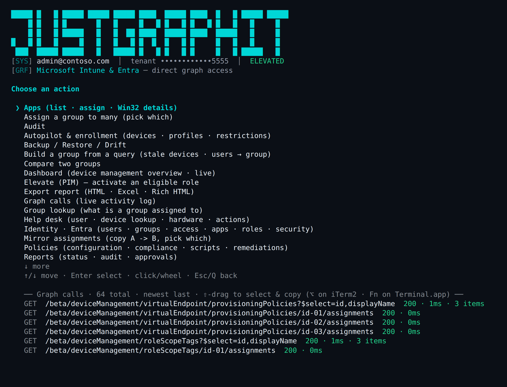
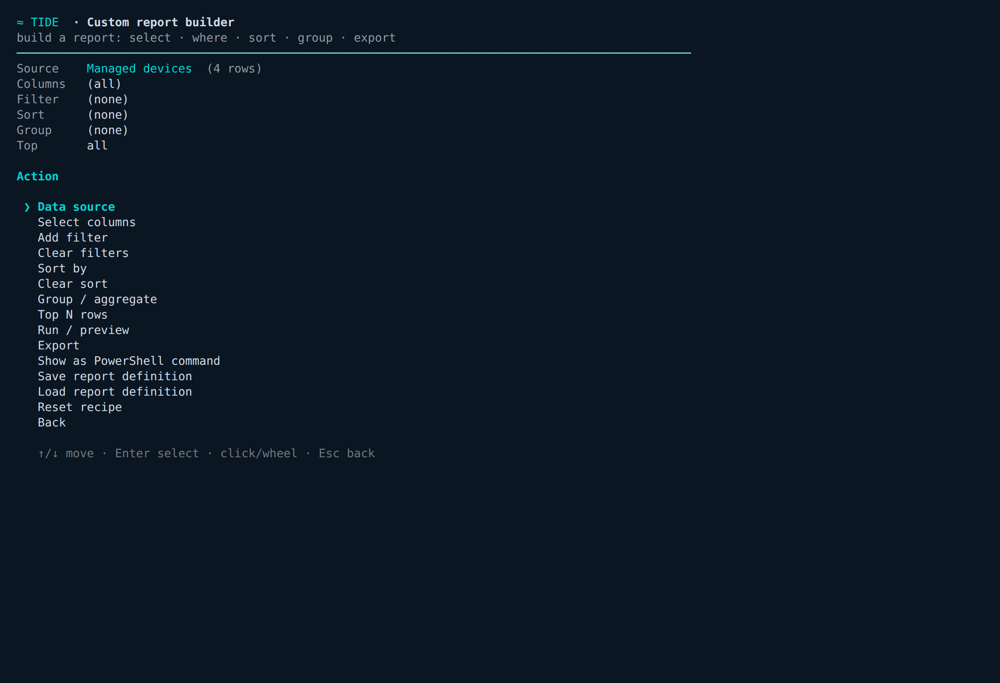

# TIDE - Targeted Intune Deployment & Endpoints

[](https://github.com/PowerShell/PowerShell)
[](#cross-platform)
[](https://learn.microsoft.com/graph/)
[](IntuneTide.Tests.ps1)
[](LICENSE)

A cross-platform **PowerShell 7 module and interactive terminal UI** for inspecting,
managing and reporting on **Microsoft Intune** — assignments, policies, apps, devices,
Windows 365, updates and baselines — across every assignable area. The UI is rendered by
a **self-contained ANSI engine** (no Spectre.Console, no WPF, no `Out-GridView`), so the
full mouse-driven, scrollable, clickable experience works identically on macOS, Windows
and Linux.

<p align="center">
  
</p>

## Features

- **Assignments** - List every assignment across configuration, compliance, apps, app
  config/protection, scripts, remediations, Windows Update rings, endpoint security,
  enrollment, Cloud PC and scope tags — with group GUIDs resolved to names,
  include/exclude, app intent, filters and settings.
- **Reverse lookup / compare / what-if** - See what a single group is assigned to, diff
  two groups, or resolve a user's or device's *effective* assignments (transitive group
  membership, exclusions win).
- **Copy / mirror** - Replicate a group's assignments onto another — all of them or a
  chosen subset (e.g. mirror config profiles but not endpoint security). Always
  read-merge-writes, so existing targets are never clobbered.
- **Scrollable, searchable, clickable tables** - Every table is a live viewer: scroll
  with arrows/wheel, `/` to filter as you type, `e` to export, `?` for help, and
  Enter/click a row to drill in. This is the cross-platform stand-in for `Out-GridView`.
- **Custom report builder** - Point at any data source and *select · where · sort ·
  group/aggregate · top-N · export* across **every property** — or print the equivalent
  PowerShell pipeline.
- **Help-desk device console** - Pick a device and pull everything a tech needs from one
  screen: hardware & compliance detail, **BitLocker recovery keys**, the **Windows LAPS
  local-admin password** (decoded), detected (discovered) apps, **group memberships**
  (which Entra groups drive its policies — assigned vs dynamic + rule), per-policy
  compliance & configuration states, and quick **actions** (sync · reboot · remote lock ·
  rotate BitLocker keys · collect diagnostics · Defender scan).
- **Reporting** - Tenant dashboard, deployment/install/compliance status, audit log,
  multi-admin approvals, and HTML / CSV / JSON / Excel exports.
- **Backup, restore & drift** - Snapshot and restore assignments or the full config
  (one file per object), and diff current state against a snapshot.
- **Live Graph-call log** - The bottom of the main menu is a copy-pasteable log of the
  actual Microsoft Graph calls TIDE made — full path + query, status and timing.
- **Eight themes, masked tenant ID, native Save dialogs** - `deepsea` (default), `green`,
  `amber`, `lego`, `sunset`, `ocean`, `forest`, `mono`; the tenant ID is masked for safe
  screenshots; exports use the OS-native "Save as…" picker.

<p align="center">
  
</p>

The **custom report builder** turns any source — Managed devices, Apps, Win32 apps,
Assignments, Deployment summary, Cloud PCs, Configuration policies, Compliance policies,
Audit log — into a report across every property, with 16 filter operators and
count/sum/avg/min/max aggregation:

<p align="center">
  
</p>

## Prerequisites

- **PowerShell 7.2+** (`pwsh`) on macOS, Windows or Linux.
- **Microsoft.Graph.Authentication** — the only required dependency.
- *Optional:* **ImportExcel** (Excel export) and **PSWriteHTML** (rich HTML report). The
  TUI hides those export options if the module isn't installed; CSV/JSON always work.

```powershell
Install-Module Microsoft.Graph.Authentication -Scope CurrentUser   # required
Install-Module ImportExcel -Scope CurrentUser                      # optional
Install-Module PSWriteHTML -Scope CurrentUser                      # optional
```

## Installation

```powershell
git clone https://github.com/ajamaya1/IntuneTide.git
Import-Module ./IntuneTide/IntuneTide.psd1
```

## Usage

```powershell
# Sign in — device code is the easy path on a Mac or over SSH
Connect-IntuneTide -UseDeviceCode

# Launch the interactive UI
Start-IntuneTide                  # default "deepsea" theme
tide                              # short alias
Start-IntuneTide -Theme sunset    # green | amber | lego | sunset | ocean | forest | mono
```

Inside a table: `↑ ↓ PgUp PgDn Home End` or the **wheel** scroll · `/` searches ·
`e` exports · `?` shows help · **Enter / click** drills in · `q` goes back.

It's also a normal scriptable module:

```powershell
Get-IntuneAssignment -AssignedOnly | Format-Table Area, Name, AssignedTo
Get-IntuneGroupAssignment -Group "All Workstations"
Compare-IntuneAssignment -GroupA Pilot -GroupB Prod | Where-Object Relationship -eq OnlyA
Get-IntuneEffectiveAssignment -User jdoe@contoso.com | Where-Object Effective

# Mirror — only some of them. -WhatIf previews; drop it to apply.
Copy-IntuneAssignment -FromGroup Pilot -ToGroup Prod -Area Configuration -WhatIf
Copy-IntuneAssignment -FromGroup Pilot -ToGroup Prod -NameLike Defender

# Templates, audit, reports
Export-IntuneAssignmentTemplate -Group "Gold Build" -Name gold -Path gold.json
(Get-IntuneAssignmentAudit -CheckEmptyGroups).EmptyGroups
Export-IntuneAssignmentReport -Format Html -Path assignments.html

# Backup / restore / drift
Backup-IntuneAssignment -Path snapshot.json
Get-IntuneAssignmentDrift -Baseline snapshot.json
```

## Authentication Notes

`Connect-IntuneTide` wraps `Connect-MgGraph` and supports interactive, device-code and
app-only sign-in.

### Device code (Mac / SSH)

```powershell
Connect-IntuneTide -UseDeviceCode
```

Prints a code and URL to authenticate in any browser — no GUI session needed on the
host, which makes it ideal on macOS or over SSH.

### App-only (automation)

```powershell
Connect-IntuneTide -TenantId contoso.com -ClientId <id> -ClientSecret <secret>
# or a certificate:
Connect-IntuneTide -TenantId contoso.com -ClientId <id> -CertificateThumbprint <thumb>
```

### Required permissions

| Scope | Purpose |
| ----- | ------- |
| `DeviceManagementConfiguration.Read.All` | Config / compliance / scripts / baselines |
| `DeviceManagementApps.Read.All` | Apps and app protection |
| `DeviceManagementServiceConfig.Read.All` | Enrollment, Autopilot, ESP |
| `DeviceManagementManagedDevices.Read.All` | Device inventory, detail & actions |
| `BitLockerKey.Read.All` | BitLocker recovery keys (help-desk) |
| `DeviceLocalCredential.Read.All` | Windows LAPS password (help-desk; `ReadBasic.All` omits the password) |
| `Group.Read.All`, `Directory.Read.All` | Resolve group/user/device names |
| `*.ReadWrite.All` (matching) | Any write / mirror / assign / remediate |

A `403` on one area is treated as "no permission / not licensed" for that area and
skipped — the rest of the sweep continues.

## PowerShell cmdlets

<details>
<summary><b>Assignments &amp; groups</b></summary>

| Cmdlet | Purpose |
| ------ | ------- |
| `Connect-IntuneTide` | Sign in (interactive / device-code / app-only) |
| `Get-IntuneAssignment` | List all assignments (`-Flat` = one row per edge) |
| `Get-IntuneGroupAssignment` | Reverse lookup — what a group is assigned to |
| `Compare-IntuneAssignment` | Diff two groups |
| `Get-IntuneEffectiveAssignment` | What-if for a user / device |
| `Copy-IntuneAssignment` | Copy / selectively mirror group → group |
| `Add-IntuneBulkAssignment` | Assign one group to many resources |
| `Export-/Import-IntuneAssignmentTemplate` | Save / apply a template |
| `Get-/New-/Remove-IntuneAssignmentFilter` | Assignment filters |

</details>

<details>
<summary><b>Backup / restore / drift</b></summary>

| Cmdlet | Purpose |
| ------ | ------- |
| `Backup-/Restore-IntuneAssignment` | Snapshot & restore assignments |
| `Get-IntuneAssignmentDrift` | Diff current state vs a snapshot |
| `Backup-/Restore-IntuneConfig` | Full config backup (one file per object) & restore |

</details>

<details>
<summary><b>Reporting &amp; devices</b></summary>

| Cmdlet | Purpose |
| ------ | ------- |
| `Get-IntuneTenantSummary` | Dashboard KPIs: device health + assignment posture |
| `Get-IntuneDeviceInventory` / `Get-IntuneDeviceDetail` | Inventory & per-device detail |
| `Get-IntuneDeploymentSummary` | Success/fail rollup by resource |
| `Get-IntuneAppInstallStatus` | App install status by device / user |
| `Get-IntuneComplianceStatus` / `Get-IntuneConfigurationStatus` | Per-policy status |
| `Get-IntuneAssignmentAudit` / `Get-IntuneAuditLog` | Tenant audit / change log |
| `Get-IntuneApprovalRequest` | Multi-admin approval requests |
| `Get-IntuneReportCatalog` / `Export-IntuneReport` | Native Intune report exports |
| `Export-IntuneAssignmentReport` / `Export-IntuneHtmlReport` / `Export-IntuneExcel` | HTML / CSV / JSON / Excel |
| `Get-IntuneBitLockerKey` | BitLocker recovery keys for a device |
| `Get-IntuneLapsCredential` | Windows LAPS local-admin account + password (decoded) |
| `Get-IntuneDeviceGroupMembership` | Entra groups a device belongs to (assigned + dynamic) |

</details>

<details>
<summary><b>Policies — config, compliance, scripts, remediations, ADMX</b></summary>

| Cmdlet | Purpose |
| ------ | ------- |
| `Get/New/Set/Remove/Copy-IntuneConfigurationPolicy` | Settings-catalog policies |
| `Get/New/Remove-IntuneCompliancePolicy` | Compliance policies |
| `Get/New/Remove-IntuneScript` | Platform scripts (Windows PS + macOS shell) |
| `Get/New/Remove/Invoke-IntuneRemediation` | Remediations (device health scripts) |
| `Get/New/Remove-IntuneAdminTemplate` | Administrative templates (ADMX) |
| `Get/Remove-IntuneDeviceConfiguration` | Legacy device configurations |

</details>

<details>
<summary><b>Apps, updates, Autopilot, baselines</b></summary>

| Cmdlet | Purpose |
| ------ | ------- |
| `Get-IntuneApp` / `Get-IntuneWin32App` / `Set-IntuneAppAssignment` / `Remove-IntuneApp` | Apps (Win32, Store, LOB, VPP, iOS, Android, macOS) |
| `Get-IntuneAppProtectionPolicy` | App protection (MAM) |
| `Get/New/Set/Remove-IntuneUpdateRing` | Windows Update rings |
| `Get/New/Remove-IntuneFeatureUpdate` / `Get/Remove-IntuneDriverUpdate` | Feature / driver updates |
| `Get/Set-IntuneAutopilotDevice` / `Get-IntuneAutopilotProfile` | Autopilot |
| `Get-IntuneEnrollmentRestriction` / `Get-IntuneESP` | Enrollment restrictions / status page |
| `Get/New-IntuneSecurityBaseline` / `Get-IntuneSecurityTemplate` | Endpoint security baselines |

</details>

<details>
<summary><b>Windows 365, RBAC, PIM, monitoring</b></summary>

| Cmdlet | Purpose |
| ------ | ------- |
| `Get-IntuneCloudPC` / `Invoke-IntuneCloudPCAction` | Browse Cloud PCs · actions |
| `Get/New/Set/Remove-IntuneCloudPCProvisioningPolicy` | Provisioning policies |
| `Get-IntuneCloudPCConnection` / `Test-IntuneCloudPCConnection` | Azure network connections |
| `Get-IntuneCloudPCImage/ServicePlan/Snapshot/UserSetting/Report` | Images · SKUs · snapshots · settings · reports |
| `Get-IntuneRbacRole` / `Get-IntuneRbacAssignment` | Intune RBAC |
| `Get-IntuneEligibleRole` / `Enable-IntuneAdminRole` / `Get-IntuneActiveRole` / `Get-IntunePimActivation` | PIM role elevation |
| `Get-IntuneConditionalAccess` | Conditional Access policies |
| `Watch-IntuneTenant` | Poll for changes |
| `Get-/Clear-IntuneCallLog` | The Graph activity log (also shown in the TUI) |
| `Start-IntuneTide` | Launch the interactive TUI (alias `tide`) |

</details>

## Project structure

```
IntuneTide/
├── IntuneTide.psd1          # module manifest (PowerShell 7.2+, exports)
├── IntuneTide.psm1          # loader — dot-sources Private + Public, exports public surface
├── Public/                  # 100 cmdlets, one per file (the public API)
│   ├── Connect-IntuneTide.ps1
│   ├── Get-IntuneAssignment.ps1
│   ├── Copy-IntuneAssignment.ps1
│   ├── Start-IntuneTide.ps1  # the whole TUI dispatch
│   └── ...
├── Private/                 # internal helpers
│   ├── Graph.ps1            # single Invoke-IaRequest seam over Invoke-MgGraphRequest + call log
│   ├── Model.ps1           # assignment / target conversion
│   ├── Tui.ps1             # self-contained ANSI engine: menus, tables, mouse, markup, themes
│   ├── Resources.ps1       # the resource registry (paths, name fields, expand flags)
│   ├── Inventory.ps1       # the cross-area assignment sweep
│   └── Backup.ps1 · Reports.ps1 · Pim.ps1 · ...
├── IntuneTide.Tests.ps1     # Pester suite — Graph mocked, fully offline
└── docs/img/                # screenshots
```

## Graph API design

Every Graph call flows through one seam — `Invoke-IaRequest` in `Private/Graph.ps1` — a
thin wrapper over `Invoke-MgGraphRequest`. The module standardizes on the **`beta`
endpoint** everywhere (richer data — extra properties and newer resource types). It
handles paging and logs each call (method, URL, status, duration, item count) to an in-memory ring
buffer. That call log powers both the **"Graph calls" screen** and the **live footer** on
the main menu, and it makes the whole suite testable: tests mock `Invoke-IaRequest` and
run fully offline. Resources are described once in `Resources.ps1` (list path, name field,
whether to expand assignments) and the inventory sweep iterates that registry, so adding a
new assignable area is a one-line registry entry.

## Device actions

`Invoke-IntuneDeviceAction -Device <name|id> -Action <action>`:

| Action | Description |
| ------ | ----------- |
| `Sync` | Force a check-in |
| `Reboot` / `FreshStart` | Restart / reset keeping user data |
| `Wipe` / `Retire` | Factory wipe / unenroll |
| `RemoteLock` / `ResetPasscode` | Lock / clear passcode |
| `Rename` | Rename the device |
| `CollectDiagnostics` | Gather diagnostic logs |
| `RotateBitLockerKeys` | Rotate BitLocker recovery keys |
| `LocateDevice` / `EnableLostMode` / `DisableLostMode` | Locate / lost mode |
| `DefenderScan` / `DefenderUpdateSignatures` | Defender scan / signature update |
| `BypassActivationLock` | Bypass Apple activation lock |

Windows 365 Cloud PCs have their own set via `Invoke-IntuneCloudPCAction`: `Reprovision`,
`Resize`, `Restart`, `Rename`, `Restore`, `Troubleshoot`, `EndGracePeriod`,
`CreateSnapshot`, `PowerOn`, `PowerOff`.

## Cross-platform

No Windows-only dependencies — no `Out-GridView`, WPF/WinForms, COM, WMI, registry or
clipboard cmdlets; every path uses `Join-Path`; exports are UTF-8 no-BOM. On macOS,
**iTerm2** is recommended (full truecolor + mouse; hold **⌥ Option** to select text while
mouse mode is on); **Terminal.app** works with approximated 256-colour accents (hold
**Fn** to select). The Pester suite includes guards that fail the build if a Windows-only
dependency is ever introduced.

## Tests

```powershell
Invoke-Pester ./IntuneTide/IntuneTide.Tests.ps1
```

149 tests, fully offline (Graph mocked at the `Invoke-IaRequest` seam).

## Roadmap

- [ ] Publish to the PowerShell Gallery
- [ ] Click a column header to sort tables (last bit of `Out-GridView` parity)
- [ ] "Save Graph log to file" for untruncated full URLs
- [ ] Toggle the Graph footer on data screens
- [ ] asciinema / GIF demo in the README
- [ ] CI workflow (lint + Pester on push)

## License

[MIT](LICENSE) © 2026 Aaron
