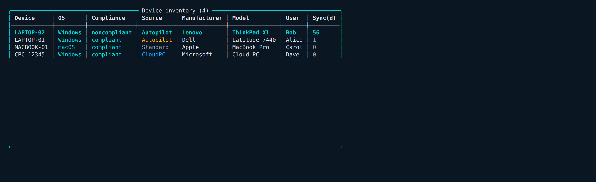

# TIDE — Targeted Intune Deployment & Endpoints

A cross-platform **PowerShell 7 module + interactive terminal UI** for inspecting,
managing and reporting on **Microsoft Intune** — assignments, policies, apps,
devices, Windows 365, updates, baselines and more — across every assignable area.

Runs identically on **macOS, Windows and Linux** under `pwsh`, on top of the
Microsoft Graph PowerShell SDK. The TUI is rendered by a **self-contained ANSI
engine** — no Spectre.Console, no WPF, no `Out-GridView` — so the full
mouse-driven, scrollable, clickable experience works the same everywhere
(`Out-GridView` is Windows-only; TIDE is the cross-platform stand-in).


---

## Table of contents

- [Highlights](#highlights)
- [Install](#install)
- [Quick start](#quick-start)
- [The terminal UI](#the-terminal-ui-start-intunetide)
  - [Navigation & mouse](#navigation--mouse)
  - [Tables — scroll, search, export, drill-in](#tables--scroll-search-export-drill-in)
  - [Custom report builder](#custom-report-builder)
  - [Live Graph-call log](#live-graph-call-log)
  - [Themes](#themes)
  - [Privacy](#privacy)
- [Common tasks (cmdlets)](#common-tasks-cmdlets)
- [Selective mirror](#selective-mirror)
- [Backup, restore & drift](#backup-restore--drift)
- [Cmdlet reference](#cmdlet-reference)
- [Graph permissions](#graph-permissions)
- [Cross-platform notes](#cross-platform-notes)
- [Tests](#tests)
- [How it's built](#how-its-built)

---

## Highlights

- **See everything** — every assignment across configuration, compliance, apps,
  app config/protection, scripts, remediations, Windows Update rings, endpoint
  security, enrollment, Cloud PC and scope tags, with group GUIDs resolved to
  names, include/exclude, app intent, filters and settings.
- **Reverse lookup / compare / what-if** — what is *this group* assigned to;
  diff two groups; resolve a user's or device's *effective* assignments
  (transitive group membership, exclusions win).
- **Copy / mirror** a group's assignments onto another — all of them or a chosen
  subset (e.g. mirror config profiles but not endpoint security).
- **Bulk-assign**, reusable **templates**, **audit** (incl. empty-group
  detection), **backup/restore/drift**, and HTML/CSV/JSON/Excel **reports**.
- **Custom report builder** — point at any data source and *select · where ·
  sort · group/aggregate · top-N · export*, or print the equivalent PowerShell.
- **Interactive TUI** — scrollable, searchable, **mouse-clickable** tables
  (the cross-platform `Out-GridView`), a live Microsoft Graph activity log, eight
  colour themes, and native "Save as…" dialogs for exports.

## Install

Requires **PowerShell 7.2+** (`pwsh`).

```powershell
# Required — the Graph SDK auth module
Install-Module Microsoft.Graph.Authentication -Scope CurrentUser

# Optional — only if you want those export formats from the TUI
Install-Module ImportExcel  -Scope CurrentUser   # Excel (.xlsx) export
Install-Module PSWriteHTML  -Scope CurrentUser   # rich interactive HTML report

# Then import TIDE
Import-Module ./IntuneTide/IntuneTide.psd1
```

> There is **no TUI dependency** to install — the interface is built in. CSV and
> JSON export work out of the box; the Excel/HTML options simply hide themselves
> if their (cross-platform) modules aren't present.

## Quick start

```powershell
# Sign in — device code is handy on a Mac or over SSH
Connect-IntuneTide -UseDeviceCode
# ...or app-only for automation:
# Connect-IntuneTide -TenantId contoso.com -ClientId <id> -ClientSecret <secret>

# Launch the interactive UI
Start-IntuneTide                  # default "deepsea" theme
tide                              # short alias

# ...or script it directly
Get-IntuneAssignment -AssignedOnly | Format-Table Area, Name, AssignedTo
Get-IntuneGroupAssignment -Group "All Workstations"
Compare-IntuneAssignment -GroupA Pilot -GroupB Prod | Where-Object Relationship -eq OnlyA
Get-IntuneEffectiveAssignment -User jdoe@contoso.com | Where-Object Effective
```

---

## The terminal UI (`Start-IntuneTide`)

The TUI is a full menu-driven console over the whole module: assignments, group
lookup, compare, what-if, mirror, bulk-assign, templates, backup/restore,
policies, reports, Windows 365, apps, Windows Update, Autopilot, security
baselines and PIM elevation — each one keypress or click away.

### Navigation & mouse

| Input | Action |
| ----- | ------ |
| `↑ ↓` / `j` `k` | Move the cursor |
| `PgUp` `PgDn` `Home` `End` | Page / jump |
| `Enter` | Select |
| **Click** | Pick a menu item / select a table row |
| **Scroll wheel** | Move / scroll |
| `Esc` / `q` | Back |

Mouse works in any terminal that forwards mouse events (Windows Terminal,
iTerm2, VS Code, most Linux terminals; `tmux` with `mouse on`). It's the
cross-platform answer to `Out-GridView`, which only exists on Windows.

### Tables — scroll, search, export, drill-in

Every big table is a live, scrollable viewer instead of a wall of text — built
for real tenants with hundreds of policies.



| Key | In a table |
| --- | ---------- |
| `↑ ↓ PgUp PgDn Home End` / wheel | Scroll (row counter shows `1-50 of 312`) |
| `/` | Live search — filter rows as you type |
| `e` | Export the table to CSV · Excel · JSON |
| `?` | Help overlay of every binding |
| `Enter` / **click** | Drill into the selected row (e.g. a device's detail) |
| `q` / `Esc` | Back |


### Custom report builder

**Reports → Custom report builder** turns any data source into a report,
interactively, across **every property** of that source:


- **Sources:** Managed devices · Apps · Win32 apps · Assignments inventory ·
  Deployment summary · Cloud PCs · Configuration policies · Compliance policies ·
  Audit log.
- **Operations:** select columns · filter (`eq ne contains startswith endswith
  like match gt ge lt le isempty notempty istrue isfalse`) · sort · group &
  aggregate (count / sum / avg / min / max) · top-N.
- **Output:** preview in the scrollable viewer, **export**, save/load the recipe
  as JSON, or **"Show as PowerShell command"** to copy the equivalent pipeline.

### Live Graph-call log

The bottom of the main menu is a live, copy-pasteable log of the actual
Microsoft Graph calls TIDE has made — full path + query string, status (green
for 2xx) and timing — so you can see and reuse exactly what it did. Hold
**⇧-drag** (⌥ on iTerm2, Fn on Terminal.app) to select past the mouse tracking.

### Themes

Eight accent themes — pass `-Theme`:

```powershell
Start-IntuneTide -Theme deepsea   # default (turquoise)
#                 green | amber | lego | sunset | ocean | forest | mono
```

### Privacy

The tenant ID is **masked** in the header (`••••••••••••5555`) so it's safe to
screenshot or screen-share. Exports use the OS-native **"Save as…" dialog**
(macOS `osascript`, Linux `zenity`) so you click a folder instead of typing a
path — with a typed-path fallback over SSH / headless.

---

## Common tasks (cmdlets)

```powershell
# Mirror — only some of them. -WhatIf previews; drop it to apply.
Copy-IntuneAssignment -FromGroup Pilot -ToGroup Prod -Area Configuration -WhatIf
Copy-IntuneAssignment -FromGroup Pilot -ToGroup Prod -NameLike Defender

# Templates
Export-IntuneAssignmentTemplate -Group "Gold Build" -Name gold -Path gold.json
Import-IntuneAssignmentTemplate -Path gold.json -Group "New Store Devices" -WhatIf

# Audit + reports
(Get-IntuneAssignmentAudit -CheckEmptyGroups).EmptyGroups
Export-IntuneAssignmentReport -Format Html -Path assignments.html

# Devices
Get-IntuneDeviceInventory | Where-Object Compliance -eq noncompliant
Get-IntuneDeviceDetail -Device LAPTOP-01 -IncludeApps
```

## Selective mirror

The "config profiles but not endpoint security" workflow — three ways, all
preserving include/exclude, app intent + settings, remediation schedules and
filters:

```powershell
Copy-IntuneAssignment -FromGroup A -ToGroup B -Area Configuration            # whole area(s)
Copy-IntuneAssignment -FromGroup A -ToGroup B -NameLike "Defender"           # by name
Copy-IntuneAssignment -FromGroup A -ToGroup B -Include "Win Baseline","Edge" # explicit list
Start-IntuneTide   # → "Mirror assignments" → tick exactly what you want
```

Every write goes through the resource's `/assign` action (which replaces the
assignment list), so the module always **read-merges-writes**: existing targets
are never clobbered and identical targets are skipped.

## Backup, restore & drift

```powershell
Backup-IntuneAssignment -Path snapshot.json        # snapshot every assignment
Restore-IntuneAssignment -Path snapshot.json -WhatIf
Get-IntuneAssignmentDrift -Baseline snapshot.json  # what changed since

Backup-IntuneConfig  -Path ./backup               # full config, one file per object
Restore-IntuneConfig -Path ./backup -WhatIf
```

## Cmdlet reference

<details>
<summary><b>Assignments &amp; groups</b></summary>

| Cmdlet | Purpose |
| ------ | ------- |
| `Connect-IntuneTide` | Sign in (interactive / device-code / app-only) |
| `Get-IntuneAssignment` | List all assignments (`-Flat` = one row per edge) |
| `Get-IntuneGroupAssignment` | Reverse lookup — what a group is assigned to |
| `Compare-IntuneAssignment` | Diff two groups |
| `Get-IntuneEffectiveAssignment` | What-if for a user / device |
| `Copy-IntuneAssignment` | Copy / selectively mirror group → group |
| `Add-IntuneBulkAssignment` | Assign one group to many resources |
| `Export-IntuneAssignmentTemplate` / `Import-IntuneAssignmentTemplate` | Save / apply a template |
| `Get-IntuneAssignmentFilter` / `New-IntuneAssignmentFilter` / `Remove-IntuneAssignmentFilter` | Assignment filters |

</details>

<details>
<summary><b>Backup / restore / drift</b></summary>

| Cmdlet | Purpose |
| ------ | ------- |
| `Backup-IntuneAssignment` / `Restore-IntuneAssignment` | Snapshot & restore assignments |
| `Get-IntuneAssignmentDrift` | Diff current state vs a snapshot |
| `Backup-IntuneConfig` / `Restore-IntuneConfig` | Full config backup (one file per object) & restore |

</details>

<details>
<summary><b>Reporting &amp; auditing</b></summary>

| Cmdlet | Purpose |
| ------ | ------- |
| `Get-IntuneTenantSummary` | Dashboard KPIs: device health + assignment posture |
| `Get-IntuneDeviceInventory` | Managed-device inventory (compliance, last sync) |
| `Get-IntuneDeviceDetail` | One device: hardware, compliance, config & app states |
| `Get-IntuneDeploymentSummary` | Success/fail rollup by resource |
| `Get-IntuneAppInstallStatus` | App install status by device / user |
| `Get-IntuneComplianceStatus` / `Get-IntuneConfigurationStatus` | Per-policy status |
| `Get-IntuneAssignmentAudit` | Tenant audit (+ empty groups) |
| `Get-IntuneAuditLog` | Directory audit log (who changed what) |
| `Get-IntuneApprovalRequest` | Multi-admin approval requests |
| `Get-IntuneReportCatalog` / `Export-IntuneReport` | Native Intune report exports |
| `Export-IntuneAssignmentReport` / `Export-IntuneHtmlReport` / `Export-IntuneExcel` | HTML / CSV / JSON / Excel reports |
| `Get-IntuneBitLockerKey` | Recovery keys for a device |

</details>

<details>
<summary><b>Policies — config, compliance, scripts, remediations, ADMX</b></summary>

| Cmdlet | Purpose |
| ------ | ------- |
| `Get/New/Set/Remove/Copy-IntuneConfigurationPolicy` | Settings-catalog policies |
| `Get/New/Remove-IntuneCompliancePolicy` | Compliance policies |
| `Get/New/Remove-IntuneScript` | Platform scripts (Windows PS + macOS shell) |
| `Get/New/Remove/Invoke-IntuneRemediation` | Remediations (device health scripts) |
| `Get/New/Remove-IntuneAdminTemplate` | Administrative templates (ADMX) |
| `Get/Remove-IntuneDeviceConfiguration` | Legacy device configurations |

</details>

<details>
<summary><b>Apps, updates, Autopilot, baselines</b></summary>

| Cmdlet | Purpose |
| ------ | ------- |
| `Get-IntuneApp` / `Get-IntuneWin32App` / `Set-IntuneAppAssignment` / `Remove-IntuneApp` | Apps (Win32, Store, LOB, VPP, iOS, Android, macOS) |
| `Get-IntuneAppProtectionPolicy` | App protection (MAM) |
| `Get/New/Set/Remove-IntuneUpdateRing` | Windows Update rings |
| `Get/New/Remove-IntuneFeatureUpdate` / `Get/Remove-IntuneDriverUpdate` | Feature / driver updates |
| `Get/Set-IntuneAutopilotDevice` / `Get-IntuneAutopilotProfile` | Autopilot |
| `Get-IntuneEnrollmentRestriction` / `Get-IntuneESP` | Enrollment restrictions / status page |
| `Get/New-IntuneSecurityBaseline` / `Get-IntuneSecurityTemplate` | Endpoint security baselines |

</details>

<details>
<summary><b>Windows 365 (Cloud PC)</b></summary>

| Cmdlet | Purpose |
| ------ | ------- |
| `Get-IntuneCloudPC` / `Invoke-IntuneCloudPCAction` | Browse Cloud PCs · reboot/reprovision/etc. |
| `Get/New/Set/Remove-IntuneCloudPCProvisioningPolicy` | Provisioning policies |
| `Get-IntuneCloudPCConnection` / `Test-IntuneCloudPCConnection` | Azure network connections |
| `Get-IntuneCloudPCImage` / `Get-IntuneCloudPCServicePlan` / `Get-IntuneCloudPCSnapshot` / `Get-IntuneCloudPCUserSetting` / `Get-IntuneCloudPCReport` | Images · SKUs · snapshots · user settings · reports |

</details>

<details>
<summary><b>RBAC, PIM, monitoring, diagnostics</b></summary>

| Cmdlet | Purpose |
| ------ | ------- |
| `Get-IntuneRbacRole` / `Get-IntuneRbacAssignment` | Intune RBAC |
| `Get-IntuneEligibleRole` / `Enable-IntuneAdminRole` / `Get-IntuneActiveRole` / `Get-IntunePimActivation` | PIM role elevation |
| `Get-IntuneConditionalAccess` | Conditional Access policies |
| `Watch-IntuneTenant` | Poll for changes |
| `Get-IntuneCallLog` / `Clear-IntuneCallLog` | The Graph activity log (also shown in the TUI) |
| `Start-IntuneTide` | Launch the interactive TUI (alias `tide`) |

</details>

## Graph permissions

Read needs `DeviceManagementConfiguration.Read.All`,
`DeviceManagementApps.Read.All`, `DeviceManagementServiceConfig.Read.All`,
`Group.Read.All`, `Directory.Read.All`. Writes need the matching
`*.ReadWrite.All` scopes (the default `Connect-IntuneTide` scope set requests
these). A `403` on one area is treated as "no permission / not licensed" for
that area and skipped — the rest of the sweep continues.

## Cross-platform notes

TIDE runs on PowerShell 7 on **macOS, Linux and Windows** with no Windows-only
dependencies (no `Out-GridView`, WPF/WinForms, COM, WMI, registry or clipboard
cmdlets; every path uses `Join-Path`; exports are UTF-8 no-BOM). On macOS:

- **iTerm2** is recommended — full 24-bit truecolor + mouse. Hold **⌥ Option**
  to select/copy text while mouse mode is on.
- **Terminal.app** works (mouse + layout fine) but renders 256 colours, so
  accents are approximated. Hold **Fn** to select text.

`Connect-IntuneTide -UseDeviceCode` is the easy path on a Mac or over SSH.

## Tests

```powershell
Invoke-Pester ./IntuneTide/IntuneTide.Tests.ps1
```

Graph is mocked at the `Invoke-IaRequest` seam, so the suite runs fully offline.
It includes guards that keep the module cross-platform (it fails the build if an
`Out-GridView` / WPF / COM / WMI dependency or an unguarded platform shell-out is
ever introduced).

## How it's built

- **`Public/*.ps1`** — one cmdlet per file; the public surface.
- **`Private/*.ps1`** — helpers: `Graph.ps1` (the single `Invoke-IaRequest`
  seam over `Invoke-MgGraphRequest` + the call log), `Model.ps1`
  (assignment/target conversion), `Tui.ps1` (the self-contained ANSI engine:
  menus, tables, mouse, markup, themes), `Resources.ps1` (the resource
  registry), plus inventory, backup, reports and PIM helpers.
- **`IntuneTide.psm1`** dot-sources everything and exports only the public
  cmdlets (+ the `tide` alias).

All TUI rendering goes through one synchronous output path and a full-screen
repaint model, so screens stay stable and there's no in-place state to drift.
