# JustGraphIT

> **Stop clicking through admin portals. Just graph it.**

[](https://github.com/PowerShell/PowerShell)
[](#cross-platform)
[](https://learn.microsoft.com/graph/)
[](JustGraphIT.Tests.ps1)
[](LICENSE)

A cross-platform **PowerShell 7 module and interactive terminal UI** that reads **and acts on**
**Microsoft Intune and Entra ID (Azure AD)** — assignments, policies, apps, devices, Windows 365,
plus users, groups, app consent, directory roles, Conditional Access and identity security — straight
over Microsoft Graph.

<p align="center">
  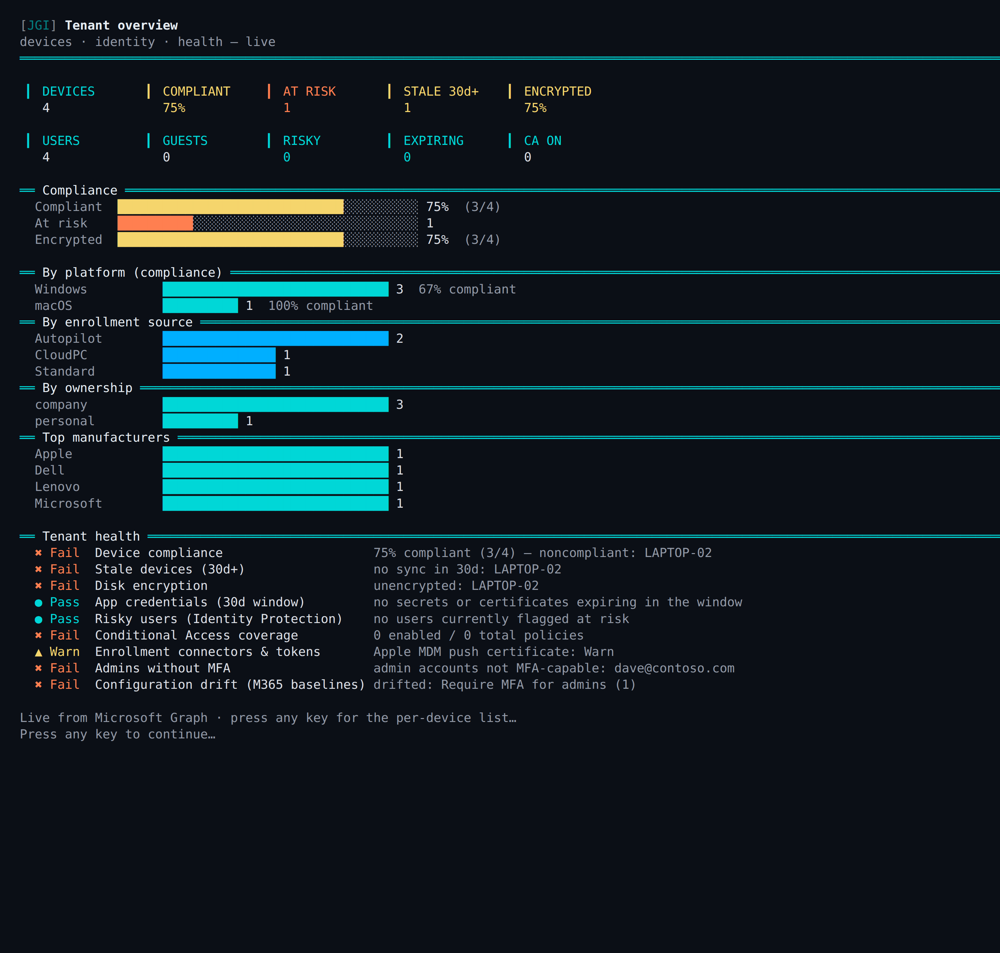
</p>

## Features

- **Assignments** - List every assignment across configuration, compliance, apps, app
  config/protection, scripts, remediations, Windows Update rings, endpoint security,
  enrollment, Cloud PC and scope tags — with group GUIDs resolved to names,
  include/exclude, app intent, filters and settings.
- **Reverse lookup / compare / what-if** - See what a single group is assigned to, diff
  two groups, or resolve a user's or device's *effective* assignments (transitive group
  membership, exclusions win).
- **Copy / mirror** - Replicate a group's assignments onto another — all of them or a
  chosen subset (e.g. mirror config profiles but not endpoint security). Always
  read-merge-writes, so existing targets are never clobbered.
- **Scrollable, searchable, clickable tables** - Every table is a live viewer: scroll
  with arrows/wheel, `/` to filter as you type, `e` to export, `?` for help, and
  Enter/click a row to drill in. This is the cross-platform stand-in for `Out-GridView`.
- **Custom report builder** - Point at any data source and *select · where · sort ·
  group/aggregate · top-N · export* across **every property** — or print the equivalent
  PowerShell pipeline.
- **Help-desk device console** - Pick a device and pull everything a tech needs from one
  screen: hardware & compliance detail, **BitLocker recovery keys**, the **Windows LAPS
  local-admin password** (decoded), detected (discovered) apps, **group memberships**
  (which Entra groups drive its policies — assigned vs dynamic + rule), per-policy
  compliance & configuration states, and quick **actions** (sync · reboot · remote lock ·
  rotate BitLocker keys · collect diagnostics · Defender scan). Also surfaces the
  **Intune-managed apps** on the device with intent (required/available) and install state,
  the exact **compliance settings that failed** (*why* it's non-compliant, not just that it
  is), and **configuration conflicts** — settings two profiles disagree on, with the
  conflicting profiles named.
- **Help-desk user lookup** - Type a UPN and pull the caller's whole footprint from one
  prompt: every managed **device**, all **Entra group memberships** (kind · assigned vs
  dynamic + rule), assigned **licenses** (friendly SKU names + service-plan health) and
  **sign-in & MFA diagnostics** — recent sign-ins with the result, the **Conditional Access
  policy that blocked** them and the user's registered MFA methods (the "why can't they log
  in?" view) — with an **Overview** that lays devices, groups and licenses out on a single
  page. Groups, licenses and sign-ins come from the **beta `/users`** and **`auditLogs`**
  endpoints.
- **Reporting** - Tenant dashboard, deployment/install/compliance status, audit log,
  multi-admin approvals, **discovered-app search** (which devices have X installed, or below a patched version — the InfoSec ask), **connector & token health** (Apple MDM push cert, VPP/DEP tokens, NDES — the silent outages), **BitLocker escrow gaps** (encrypted, no key in Entra), **MFA registration gaps** (not MFA-capable, unprotected admins first), **expiring secrets & certificates** (app registrations and
  enterprise apps, with days-to-expiry), **config drift against M365 baselines** (Microsoft-detected: what changed, desired vs current), and HTML / CSV / JSON / Excel exports.
- **Health check & change receipt** - `Invoke-IntuneHealthCheck` runs the "is anything
  on fire?" morning sweep headlessly (compliance %, stale devices, encryption, expiring
  app credentials, risky users, Conditional Access coverage, connector/token health,
  admins without MFA, config drift against M365 baselines) — schedule it and alert on anything not `Pass`, or render the whole
  thing as a portable HTML page with `Export-IntuneHealthReport` for the Monday email. `Export-IntuneChangeLog` writes an audit receipt of every change
  the session made (method, path, status) for the change ticket.
- **Backup, restore & drift** - Snapshot and restore assignments or the full config
  (one file per object), and diff current state against a snapshot.
- **Live Graph-call log** - The bottom of the main menu is a copy-pasteable log of the
  actual Microsoft Graph calls JustGraphIT made — full path + query, status and timing.
- **Eight themes, masked tenant ID, native Save dialogs** - `deepsea` (default), `green`,
  `amber`, `lego`, `sunset`, `ocean`, `forest`, `mono`; the tenant ID is masked for safe
  screenshots; exports use the OS-native "Save as…" picker.

<p align="center">
  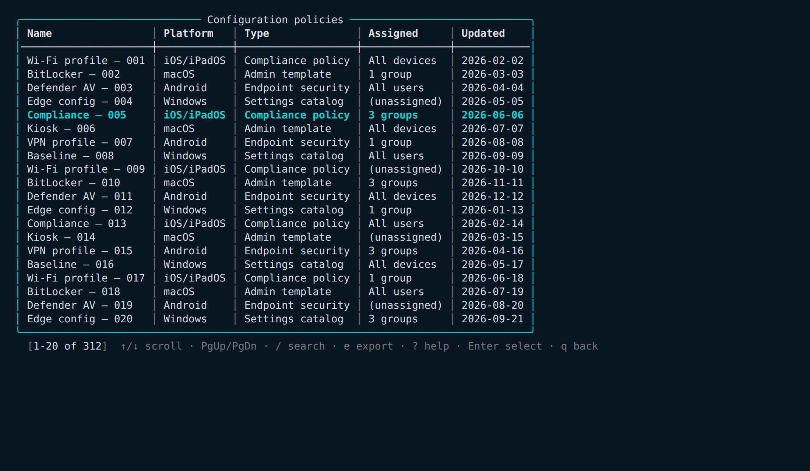
</p>

The **custom report builder** turns any source — Managed devices, Apps, Win32 apps,
Assignments, Deployment summary, Cloud PCs, Configuration policies, Compliance policies,
Audit log — into a report across every property, with 16 filter operators and
count/sum/avg/min/max aggregation:

<p align="center">
  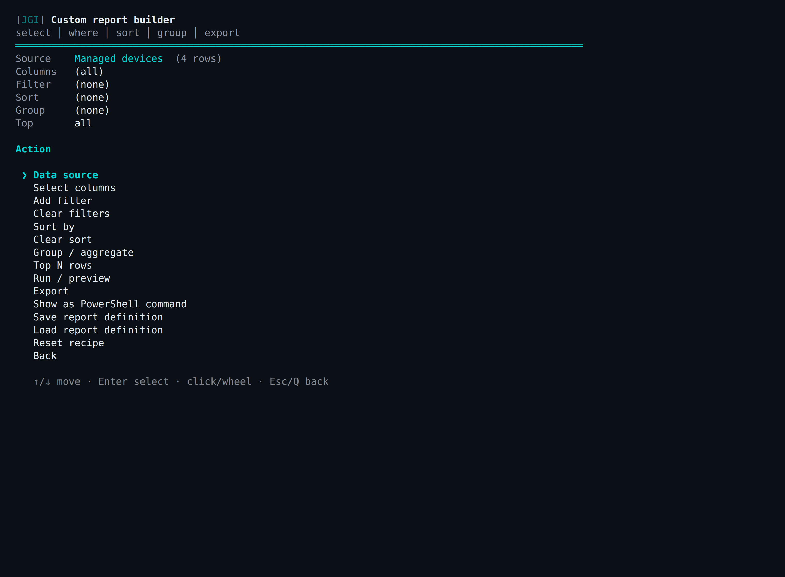
</p>

## Common workflows

The five things JustGraphIT gets reached for most — each is a few keystrokes from the main menu.

**1. Help-desk user lookup** — one UPN → the caller's devices, Entra group memberships and
licenses on a single **Overview** page (friendly SKU names like *Microsoft 365 E5*, with
half-provisioned service plans flagged).

<p align="center">
  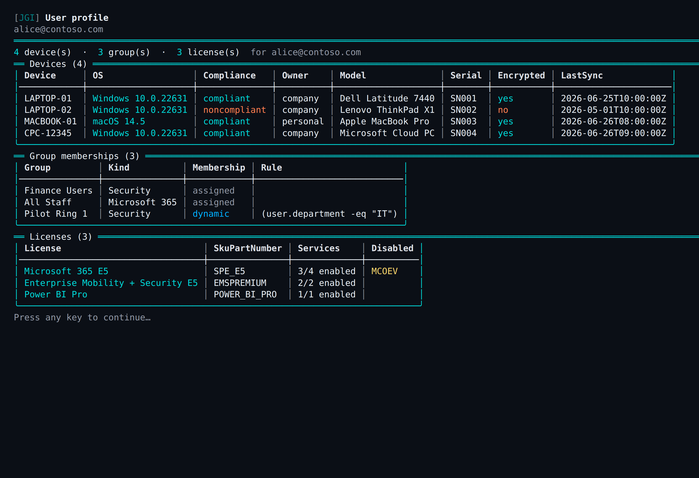
</p>

**2. Sign-in & MFA diagnostics** — "why can't they log in?" Recent sign-ins with the result,
the failure reason, the **Conditional Access policy that blocked** the attempt, and the
user's registered MFA methods.

<p align="center">
  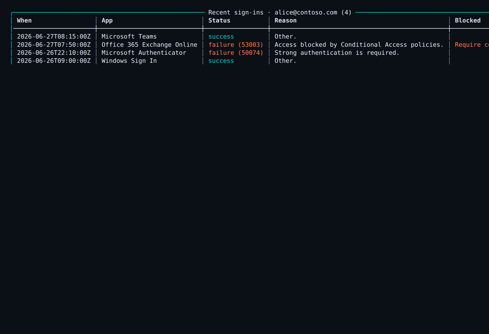
</p>

**3. Compliance failures** — drill past the `noncompliant` label to the exact settings that
failed (BitLocker, minimum OS), so the tech sees *what to fix*.

<p align="center">
  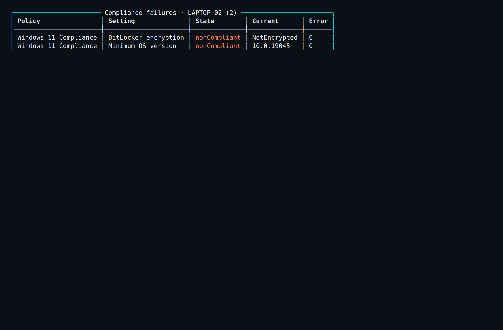
</p>

**4. Device recovery** — the **Windows LAPS local-admin password** (decoded, newest backup
first) and **BitLocker recovery keys**, straight from the device console.

<p align="center">
  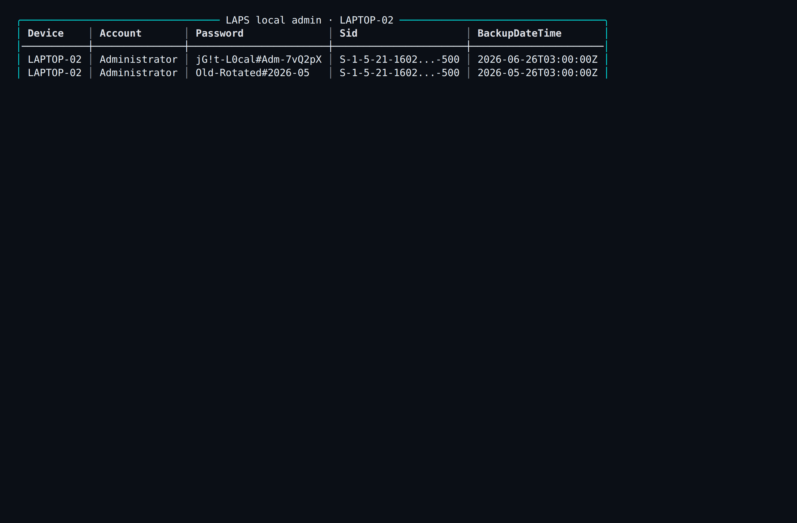
</p>

**5. Cloud PC usage** — total active hours and connection counts per Cloud PC (spot the
heavily-used and the idle), plus daily / quality / frontline / inaccessible reports.

<p align="center">
  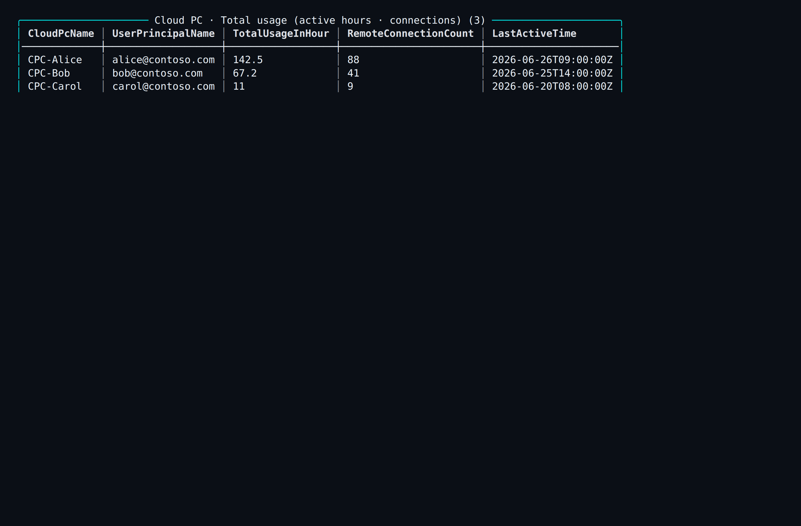
</p>


## Prerequisites

- **PowerShell 7.2+** (`pwsh`) on macOS, Windows or Linux.
- **Microsoft.Graph.Authentication** — the only required dependency.
- *Optional:* **ImportExcel** (Excel export) and **PSWriteHTML** (rich HTML report). The
  TUI hides those export options if the module isn't installed; CSV/JSON always work.

```powershell
Install-Module Microsoft.Graph.Authentication -Scope CurrentUser   # required
Install-Module ImportExcel -Scope CurrentUser                      # optional
Install-Module PSWriteHTML -Scope CurrentUser                      # optional
```

## Installation

**From the PowerShell Gallery** (once published):

```powershell
Install-Module JustGraphIT -Scope CurrentUser
```

**From source:**

```powershell
git clone https://github.com/ajamaya1/JustGraphIT.git
Import-Module ./JustGraphIT/JustGraphIT.psd1
```

### Try it offline (no tenant, no dependencies)

Explore the whole UI with mock data — nothing touches a real tenant:

```powershell
pwsh -NoProfile -File ./JustGraphIT/examples/Invoke-JustGraphITDemo.ps1
```

## Usage

```powershell
# Sign in — device code is the easy path on a Mac or over SSH
Connect-JustGraphIT -UseDeviceCode

# Launch the interactive UI
Start-JustGraphIT                  # default "deepsea" theme
jgi                                # short alias (also: jgit)
Start-JustGraphIT -Theme sunset    # green | amber | lego | sunset | ocean | forest | mono
```

Inside a table: `↑ ↓ PgUp PgDn Home End` or the **wheel** scroll · `/` searches ·
`e` exports · `p` pushes to Teams · `?` shows help · **Enter / click** drills in · `q` goes back.

It's also a normal scriptable module:

```powershell
Get-IntuneAssignment -AssignedOnly | Format-Table Area, Name, AssignedTo
Get-IntuneGroupAssignment -Group "All Workstations"
Compare-IntuneAssignment -GroupA Pilot -GroupB Prod | Where-Object Relationship -eq OnlyA
Get-IntuneEffectiveAssignment -User jdoe@contoso.com | Where-Object Effective

# Mirror — only some of them. -WhatIf previews; drop it to apply.
Copy-IntuneAssignment -FromGroup Pilot -ToGroup Prod -Area Configuration -WhatIf
Copy-IntuneAssignment -FromGroup Pilot -ToGroup Prod -NameLike Defender

# Templates, audit, reports
Export-IntuneAssignmentTemplate -Group "Gold Build" -Name gold -Path gold.json
(Get-IntuneAssignmentAudit -CheckEmptyGroups).EmptyGroups
Export-IntuneAssignmentReport -Format Html -Path assignments.html

# Backup / restore / drift
Backup-IntuneAssignment -Path snapshot.json
Get-IntuneAssignmentDrift -Baseline snapshot.json
```

## Authentication Notes

`Connect-JustGraphIT` wraps `Connect-MgGraph` and supports interactive, device-code and
app-only sign-in.

### Device code (Mac / SSH)

```powershell
Connect-JustGraphIT -UseDeviceCode
```

Prints a code and URL to authenticate in any browser — no GUI session needed on the
host, which makes it ideal on macOS or over SSH.

### App-only (automation)

```powershell
Connect-JustGraphIT -TenantId contoso.com -ClientId <id> -ClientSecret <secret>
# or a certificate:
Connect-JustGraphIT -TenantId contoso.com -ClientId <id> -CertificateThumbprint <thumb>
```

### Required permissions

| Scope | Purpose |
| ----- | ------- |
| `DeviceManagementConfiguration.Read.All` | Config / compliance / scripts / baselines |
| `DeviceManagementApps.Read.All` | Apps and app protection |
| `DeviceManagementServiceConfig.Read.All` | Enrollment, Autopilot, ESP |
| `DeviceManagementManagedDevices.Read.All` | Device inventory, detail & actions |
| `BitLockerKey.Read.All` | BitLocker recovery keys (help-desk) |
| `DeviceLocalCredential.Read.All` | Windows LAPS password (help-desk; `ReadBasic.All` omits the password) |
| `User.Read.All` | User licenses & profile for the help-desk user lookup |
| `AuditLog.Read.All` | User sign-in diagnostics (needs an Entra ID P1/P2 tenant) |
| `UserAuthenticationMethod.Read.All` | A user's registered MFA methods |
| `ConfigurationMonitoring.Read.All` | Microsoft 365 config-drift monitors & drift results |
| `Group.Read.All`, `Directory.Read.All` | Resolve group/user/device names; user/device group memberships |
| `DeviceManagementConfiguration.ReadWrite.All` | Create / edit / **assign** config, compliance, scripts, baselines, update rings; remediations |
| `DeviceManagementApps.ReadWrite.All` | Assign apps; app protection / configuration |
| `DeviceManagementServiceConfig.ReadWrite.All` | Enrollment, Autopilot and ESP changes |
| `DeviceManagementManagedDevices.PrivilegedOperations.All` | Device actions — wipe, retire, fresh start |
| `CloudPC.ReadWrite.All` | Windows 365 provisioning policies and Cloud PC actions |
| `Group.ReadWrite.All`, `GroupMember.ReadWrite.All` | Create groups; **mirror / bulk-assign** by adding & removing members |
| `User.ReadWrite.All` | Enable / disable users; licence assignment |
| `UserAuthenticationMethod.ReadWrite.All` | Reset MFA, issue a Temporary Access Pass, add phone methods |
| `IdentityRiskyUser.ReadWrite.All` | Dismiss or confirm risky users |

A `403` on one area is treated as "no permission / not licensed" for that area and
skipped — the rest of the sweep continues.

## PowerShell cmdlets

<details>
<summary><b>Assignments &amp; groups</b></summary>

| Cmdlet | Purpose |
| ------ | ------- |
| `Connect-JustGraphIT` | Sign in (interactive / device-code / app-only) |
| `Get-IntuneAssignment` | List all assignments (`-Flat` = one row per edge) |
| `Get-IntuneGroupAssignment` | Reverse lookup — what a group is assigned to |
| `Compare-IntuneAssignment` | Diff two groups |
| `Get-IntuneEffectiveAssignment` | What-if for a user / device |
| `Copy-IntuneAssignment` | Copy / selectively mirror group → group |
| `Add-IntuneBulkAssignment` | Assign one group to many resources |
| `Export-/Import-IntuneAssignmentTemplate` | Save / apply a template |
| `Get-/New-/Remove-IntuneAssignmentFilter` | Assignment filters |

</details>

<details>
<summary><b>Backup / restore / drift</b></summary>

| Cmdlet | Purpose |
| ------ | ------- |
| `Backup-/Restore-IntuneAssignment` | Snapshot & restore assignments |
| `Get-IntuneAssignmentDrift` | Diff current state vs a snapshot |
| `Backup-/Restore-IntuneConfig` | Full config backup (one file per object) & restore |

</details>

<details>
<summary><b>Reporting &amp; devices</b></summary>

| Cmdlet | Purpose |
| ------ | ------- |
| `Get-IntuneTenantSummary` | Dashboard KPIs: device health + assignment posture |
| `Get-IntuneDeviceInventory` / `Get-IntuneDeviceDetail` | Inventory & per-device detail |
| `Get-IntuneStaleDevice` | Devices not synced in N+ days (feeds "build a group from a query") |
| `Set-IntuneDevicePrimaryUser` · `Set-IntuneDeviceCategory` / `Get-IntuneDeviceCategory` | Re-point primary user · assign device category |
| `Get-IntuneDeploymentSummary` | Success/fail rollup by resource |
| `Get-IntuneAppInstallStatus` | App install status by device / user |
| `Get-IntuneComplianceStatus` / `Get-IntuneConfigurationStatus` | Per-policy status |
| `Get-IntuneAssignmentAudit` / `Get-IntuneAuditLog` | Tenant audit / change log |
| `Get-IntuneApprovalRequest` | Multi-admin approval requests |
| `Get-IntunePatchReport` | Windows patch status (quality + feature updates) from Intune report exports |
| `Get-IntuneReportCatalog` / `Export-IntuneReport` | Native Intune report exports |
| `Export-IntuneAssignmentReport` / `Export-IntuneHtmlReport` / `Export-IntuneExcel` | HTML / CSV / JSON / Excel |
| `Get-IntuneBitLockerKey` | BitLocker recovery keys for a device |
| `Get-IntuneLapsCredential` | Windows LAPS local-admin account + password (decoded) |
| `Get-IntuneDeviceGroupMembership` | Entra groups a device belongs to (assigned + dynamic) |
| `Get-IntuneDeviceManagedApp` | Intune-managed apps on a device + intent & install state |
| `Get-IntuneDeviceComplianceDetail` | Per-setting compliance results — *why* a device is non-compliant (`-FailingOnly`) |
| `Get-IntuneDeviceConfigConflict` | Settings two profiles disagree on, with the conflicting profiles named |
| `Get-IntuneUserDevice` | All Intune-managed devices for a user (UPN) |
| `Get-IntuneUserGroupMembership` | Entra groups a user belongs to — kind · assigned/dynamic + rule (beta `/users`) |
| `Get-IntuneUserLicense` | Licenses assigned to a user — friendly SKU name + service-plan health (beta `/users`) |
| `Get-IntuneUserSignIn` | Recent Entra sign-ins — result, failure reason + the blocking CA policy |
| `Get-IntuneUserAuthMethod` | A user's registered authentication (MFA) methods |

</details>

<details>
<summary><b>Policies — config, compliance, scripts, remediations, ADMX</b></summary>

| Cmdlet | Purpose |
| ------ | ------- |
| `Get/New/Set/Remove/Copy-IntuneConfigurationPolicy` | Settings-catalog policies |
| `Get/New/Remove-IntuneCompliancePolicy` | Compliance policies |
| `Get/New/Remove-IntuneScript` | Platform scripts (Windows PS + macOS shell) |
| `Get/New/Remove/Invoke-IntuneRemediation` | Remediations (device health scripts) |
| `Get/New/Remove-IntuneAdminTemplate` | Administrative templates (ADMX) |
| `Get/Remove-IntuneDeviceConfiguration` | Legacy device configurations |

</details>

<details>
<summary><b>Apps, updates, Autopilot, baselines</b></summary>

| Cmdlet | Purpose |
| ------ | ------- |
| `Get-IntuneApp` / `Get-IntuneWin32App` / `Set-IntuneAppAssignment` / `Remove-IntuneApp` | Apps (Win32, Store, LOB, VPP, iOS, Android, macOS) |
| `Get-IntuneAppProtectionPolicy` | App protection (MAM) |
| `Get/New/Set/Remove-IntuneUpdateRing` | Windows Update rings |
| `Get/New/Remove-IntuneFeatureUpdate` / `Get/Remove-IntuneDriverUpdate` | Feature / driver updates |
| `Get/Set-IntuneAutopilotDevice` / `Get-IntuneAutopilotProfile` | Autopilot |
| `Get-IntuneEnrollmentRestriction` / `Get-IntuneESP` | Enrollment restrictions / status page |
| `Get/New-IntuneSecurityBaseline` / `Get-IntuneSecurityTemplate` | Endpoint security baselines |

</details>

<details>
<summary><b>Windows 365, RBAC, PIM, monitoring</b></summary>

| Cmdlet | Purpose |
| ------ | ------- |
| `Get-IntuneCloudPC` / `Invoke-IntuneCloudPCAction` | Browse Cloud PCs · actions |
| `Get/New/Set/Remove-IntuneCloudPCProvisioningPolicy` | Provisioning policies |
| `Get-IntuneCloudPCConnection` / `Test-IntuneCloudPCConnection` | Azure network connections |
| `Get-IntuneCloudPCImage/ServicePlan/Snapshot/UserSetting/Report` | Images · SKUs · snapshots · settings · reports |
| `Get-IntuneRbacRole` / `Get-IntuneRbacAssignment` | Intune RBAC |
| `Get-IntuneEligibleRole` / `Enable-IntuneAdminRole` / `Get-IntuneActiveRole` / `Get-IntunePimActivation` | PIM role elevation |
| `Get-IntuneConditionalAccess` | Conditional Access policies |
| `Watch-IntuneTenant` | Poll for changes |
| `Get-/Clear-IntuneCallLog` | The Graph activity log (also shown in the TUI) |
| `Start-JustGraphIT` | Launch the interactive TUI (alias `jgi` / `jgit`) |

</details>

<details>
<summary><b>Identity · Entra — users, groups, access, apps, security</b></summary>

| Cmdlet | Purpose |
| ------ | ------- |
| `Get-/Set-/New-EntraUser` · `Reset-EntraUserPassword` · `Revoke-EntraUserSession` | Find, report, update, create users; reset password; revoke sessions |
| `Reset-EntraUserMfa` · `New-EntraUserTempAccessPass` · `Get-EntraUserAuthMethod` | MFA reset · Temporary Access Pass (passkey enrollment) · registered methods |
| `Set-EntraUserLicense` · `Add-/Remove-EntraUserFromGroup` | License assign/remove · group membership |
| `Get-EntraInactiveUser` · `Get-EntraGuestUser` | Lifecycle hygiene — stale accounts by last sign-in · guest/B2B audit |
| `Get-/New-/Set-/Remove-EntraGroup` · `Add-/Remove-EntraGroupMember` · `Add-/Remove-EntraGroupOwner` | Groups: list/create (security · M365 · dynamic), members, owners |
| `Get-EntraLicense` | Tenant SKUs — consumed/available + service plans |
| `Get-EntraSignIn` · `Get-EntraConditionalAccessPolicy` / `Set-EntraConditionalAccessState` | Sign-ins · Conditional Access policies & state |
| `Get-EntraRiskyUser` / `Set-EntraRiskyUser` | Identity Protection — dismiss / confirm-compromised |
| `Get-EntraAppRegistration` · `Get-EntraEnterpriseApp` · `Get-EntraManagedIdentity` | Applications, service principals, managed identities |
| `Get-EntraExpiringSecret` · `Get-EntraAppWithoutOwner` · `Get-EntraAppCredentialSummary` | App hygiene — expiring secrets/certs, orphaned apps, credential status |
| `Get-EntraAppPermission` · `Get-EntraRiskyAppPermission` | What an app can do (delegated + application perms) · tenant consent audit (high-risk Graph permissions) |
| `Remove-EntraAppRoleAssignment` · `Remove-EntraOAuth2Grant` | Revoke an application permission · revoke a delegated consent grant |
| `Get-EntraDirectoryRole` / `Get-EntraRoleAssignment` · `Get-EntraPimEligibility` / `Get-EntraPimActive` | Directory roles & assignments · PIM eligible/active |
| `Get-EntraSecureScore` · `Get-EntraSecurityAlert` · `Get-EntraSecurityIncident` | Microsoft 365 Defender / XDR — score, alerts, incidents |
| `Get-EntraMailboxUsage` · `Get-EntraOneDriveUsage` · `Get-EntraSharePointUsage` · `Get-EntraTeamsUsage` · `Get-EntraM365AppUsage` | Usage & quota reports (mailbox · OneDrive · SharePoint · Teams · M365 Apps) |

All read cmdlets take `-Raw` for the full property set; all writes are `SupportsShouldProcess`-gated. Every endpoint uses Graph **beta**.

</details>

<details>
<summary><b>Identity · Entra — write / provision actions (do-it-from-the-CLI)</b></summary>

Anything you'd normally open the portal for, from the command line:

| Cmdlet | Purpose |
| ------ | ------- |
| `Add-/Remove-EntraAppPermission` · `Get-EntraAppRequestedPermission` | Edit an app registration's requested API permissions (by friendly name) |
| `Grant-EntraAdminConsent` | The portal's "Grant admin consent" — app-role assignments + delegated grants |
| `New-EntraServicePrincipal` | Materialise the enterprise app for an app registration |
| `New-/Set-/Remove-EntraAppRegistration` · `New-EntraAppSecret` | Create / update / delete app registrations; add a client secret |
| `Add-/Remove-EntraAppRedirectUri` · `Get-/Add-/Remove-EntraAppOwner` | Redirect URIs (Web/Spa/PublicClient) and owners |
| `New-EntraGuestInvitation` | Invite an external / B2B guest user (returns the redeem URL) |
| `New-EntraTeam` · `Get-/New-/Remove-EntraTeamChannel` · `Get-/Add-/Remove-EntraTeamMember` | Create a Microsoft 365 Team; manage its channels & members |
| `New-/Remove-EntraRoleAssignment` | Permanent directory-role assignment |
| `New-/Remove-EntraPimEligibility` · `Enable-EntraPimRole` | PIM: grant eligibility (admin) · activate your own eligible role |
| `New-/Set-/Remove-EntraConditionalAccessPolicy` · `Get-/New-/Remove-EntraNamedLocation` | Author Conditional Access policies and named locations |
| `Set-EntraGroupLicense` | Group-based licensing (members inherit the SKU) |
| `Add-EntraGroupMemberBulk` | Push a whole filtered population into a group at once |
| `Get-/Remove-EntraUserManager` | Read / clear a user's manager (`Set-EntraUser -ManagerUser` sets it) |
| `Get-/Set-/Remove-EntraDevice` · `Get-EntraDeviceRegisteredOwner` | Enable / disable / delete registered (Entra) devices; read owners |
| `Get-EntraBitLockerKey` · `Get-EntraLapsCredential` | Reveal BitLocker recovery keys and Windows LAPS local-admin passwords (audited) |
| `Get-/Set-EntraAuthorizationPolicy` · `Get-/Set-EntraSecurityDefault` | Tenant settings — default-user-role permissions, SSPR, guest policy, Security Defaults |
| `Get-/New-/Set-/Remove-EntraRoleDefinition` · `Get-EntraRoleAction` | Custom directory roles, composed from the live action catalogue |
| `Get-/Restore-/Remove-EntraDeletedItem` | Directory recycle bin — restore or purge soft-deleted users / groups / apps |
| `Get-/Set-EntraUserMfaState` · `Add-EntraUserPhoneMethod` | Per-user MFA state (disabled/enabled/enforced) and admin-registered phone methods |

**Query → group:** the main-menu *"Build a group from a query"* flow filters a population — devices not synced in *N* days (`Get-IntuneStaleDevice`), **devices carrying a discovered app** (Zscaler, Chrome below a patched build…), users by display-name prefix, or inactive users — then bulk-adds the set to a new or existing group. Same for any `Get-EntraUser -Filter "startswith(displayName,'EX')"` result.

**Discovered app → group, for runbooks:** `Sync-IntuneDiscoveredAppGroup` keeps an Entra
security group in lock-step with a discovered-app query — creates the group on first run,
adds matching devices idempotently, and with `-RemoveHealed` drops devices as they're
remediated. Schedule it (Azure Automation / scheduled task, app-only auth) and point
remediations, required-app deployments or Conditional Access at the group:

```powershell
Sync-IntuneDiscoveredAppGroup -Name zscaler -BelowVersion 4.3 `
    -GroupName 'sec-zscaler-below-4.3' -RemoveHealed -Confirm:$false
```

**All of the above is reachable from the menus**, not just the CLI. Under **Identity · Entra**:

- *Dashboard* → a live identity overview: user / guest / group / app / device counts, a Microsoft Secure Score gauge, and Users / Groups / Conditional Access breakdowns.
- *Applications* → pick an app registration → add/remove API permissions, grant admin consent, client secrets, redirect URIs, owners, rename/delete, create its enterprise app.
- *Enterprise apps* → pick a service principal → see exactly what it can do, then **revoke a delegated grant** or an **application permission**.
- *Groups* → group card → members, **owners (add/remove)**, group-based licensing, update, delete; plus **Create a Team** and **Manage a Team** (channels · members).
- *Devices* → enable / disable / delete registered devices, registered owners, and **reveal BitLocker recovery keys & the Windows LAPS local-admin password** (both audited).
- *Conditional Access* → **create** a policy (report-only by default), change state, **rename**, delete; **named locations** (IP/country) create & delete.
- *Directory roles* → assign/remove; **Custom roles** → create / edit / delete role definitions from the live action catalogue; *PIM* → activate your own eligible role, make a user eligible, **remove eligibility**.
- *Tenant settings* → toggle whether users can register apps / create groups / create tenants / read other users, SSPR, the guest-invite policy, and the **Security Defaults** switch.
- *Deleted items* → restore or permanently purge soft-deleted users / groups / apps (the directory recycle bin).
- *Lifecycle* → invite a guest; inactive-user & guest reports. *Help-desk user card* → reset password / MFA / TAP, **set per-user MFA state**, add a phone method.

<p align="center">
  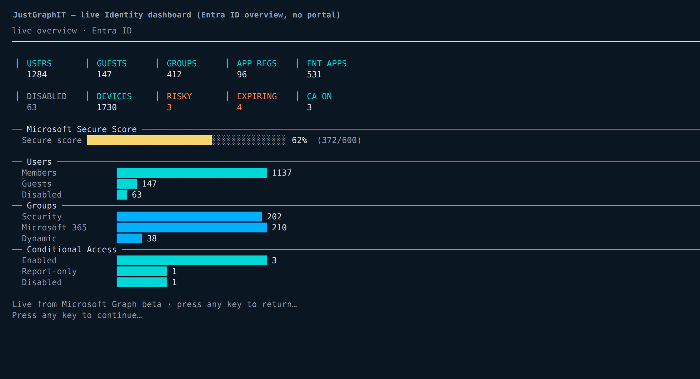
</p>
<p align="center">
  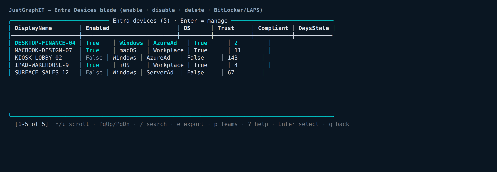
</p>
<p align="center">
  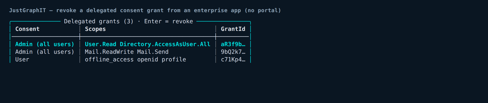
  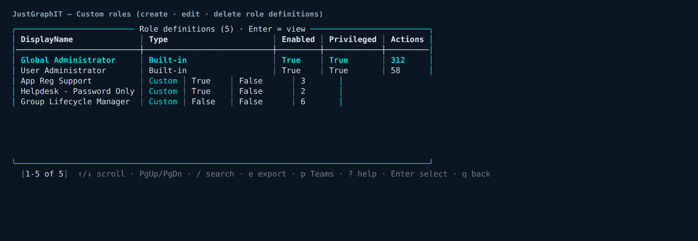
</p>
<p align="center">
  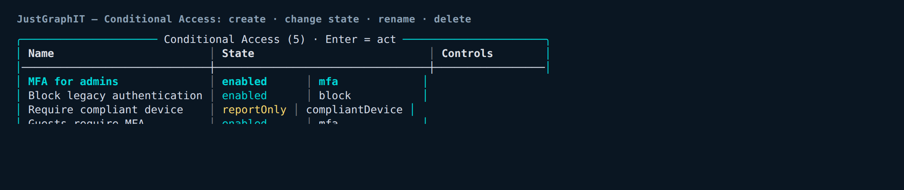
  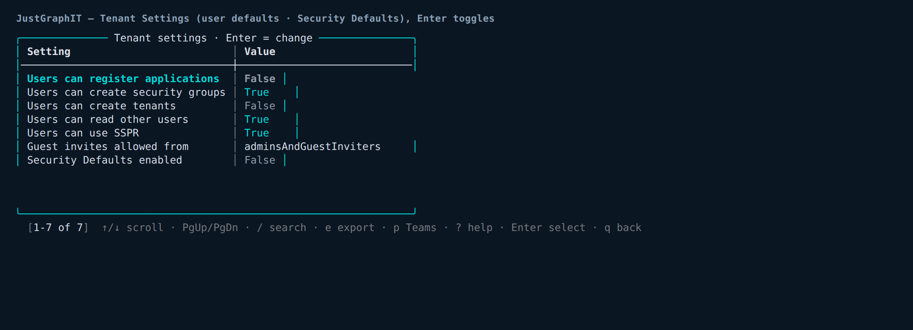
</p>

On the Intune side the menus cover browse / assign / **delete** for apps, configuration, compliance, scripts, remediations, update rings (now **create / edit / delete**), feature & driver update profiles, **assignment filters** (create/delete), and legacy device-config + ADMX profiles. Authoring policies whose definition is a full settings-catalog / compliance-rule / script body (`New-IntuneConfigurationPolicy`, `New-IntuneCompliancePolicy`, `New-IntuneScript`, `New-IntuneRemediation`, `New-IntuneAdminTemplate`, and the matching `Set-*` patches) stays a **CLI-first** operation by design — those take structured bodies a menu can't sensibly capture — but everything they create is fully browsable, assignable and deletable from the TUI.

</details>

## Project structure

```
JustGraphIT/
├── JustGraphIT.psd1          # module manifest (PowerShell 7.2+, exports)
├── JustGraphIT.psm1          # loader — dot-sources Private + Public, exports public surface
├── Public/                  # 227 cmdlets (the public API)
│   ├── Connect-JustGraphIT.ps1
│   ├── Get-IntuneAssignment.ps1
│   ├── Copy-IntuneAssignment.ps1
│   ├── Start-JustGraphIT.ps1  # the whole TUI dispatch
│   └── ...
├── Private/                 # internal helpers
│   ├── Graph.ps1            # single Invoke-IaRequest seam over Invoke-MgGraphRequest + call log
│   ├── Model.ps1           # assignment / target conversion
│   ├── Tui.ps1             # self-contained ANSI engine: menus, tables, mouse, markup, themes
│   ├── Resources.ps1       # the resource registry (paths, name fields, expand flags)
│   ├── Inventory.ps1       # the cross-area assignment sweep
│   └── Backup.ps1 · Reports.ps1 · Pim.ps1 · ...
├── JustGraphIT.Tests.ps1     # Pester suite — Graph mocked, fully offline
└── docs/img/                # screenshots
```

## Graph API design

Every Graph call flows through one seam — `Invoke-IaRequest` in `Private/Graph.ps1` — a
thin wrapper over `Invoke-MgGraphRequest`. The module standardizes on the **`beta`
endpoint** everywhere (richer data — extra properties and newer resource types). It
handles paging, **retries throttled / transient failures** (429 / 503 / 504 on any verb,
500 on idempotent GETs) honoring the server's `Retry-After` header with exponential
backoff, and records the **real HTTP status** on each call. It logs every call (method,
URL, status, duration, item count) to an in-memory ring buffer. That call log powers both the **"Graph calls" screen** and the **live footer** on
the main menu, and it makes the whole suite testable: tests mock `Invoke-IaRequest` and
run fully offline. Resources are described once in `Resources.ps1` (list path, name field,
whether to expand assignments) and the inventory sweep iterates that registry, so adding a
new assignable area is a one-line registry entry.

## Device actions

`Invoke-IntuneDeviceAction -Device <name|id> -Action <action>`:

| Action | Description |
| ------ | ----------- |
| `Sync` | Force a check-in |
| `Reboot` / `FreshStart` | Restart / reset keeping user data |
| `Wipe` / `Retire` | Factory wipe / unenroll |
| `RemoteLock` / `ResetPasscode` | Lock / clear passcode |
| `Rename` | Rename the device |
| `CollectDiagnostics` | Gather diagnostic logs |
| `RotateBitLockerKeys` | Rotate BitLocker recovery keys |
| `LocateDevice` / `EnableLostMode` / `DisableLostMode` | Locate / lost mode |
| `DefenderScan` / `DefenderUpdateSignatures` | Defender scan / signature update |
| `BypassActivationLock` | Bypass Apple activation lock |

Windows 365 Cloud PCs have their own set via `Invoke-IntuneCloudPCAction`: `Reprovision`,
`Resize`, `Restart`, `Rename`, `Restore`, `Troubleshoot`, `EndGracePeriod`,
`CreateSnapshot`, `PowerOn`, `PowerOff`.

## License

[MIT](LICENSE) © 2026 Aaron
